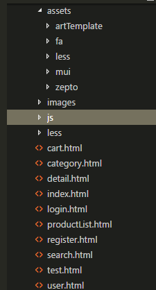

### manmanbuy
1.使用mui框架
2.使用zepto框架
3.使用sass编译器

### 使用git步骤及注意事项

1.将自己本机的ssh key 及自己github上的账号发给钟秋兰
2.通过命令，克隆数据到本地（记住.git文件不要删除）
git clone git@github.com:zhongqiulan/manmanbuy.git
3.添加自己的文件夹，如 cheaper.html(记住文件夹里需要写入内容)
4.文件目录结构
 
5.git add .
6.git commit -m "修改了git -byzql"
备注：请大家多写备注啊，并且加上名字的拼音首字母
6.git remote add origin git@github.com:zhongqiulan/manmanbuy.git
7.git push -u origin master
###最后大家记得无论什么时候提交代码

###先git pull再git push

git pull
git push 
